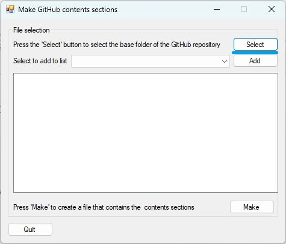
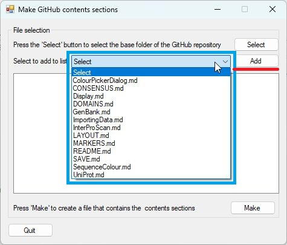
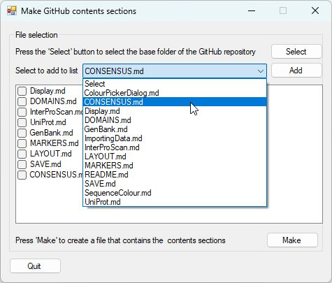
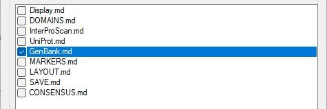
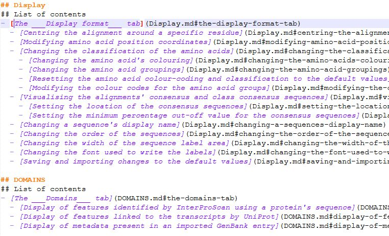
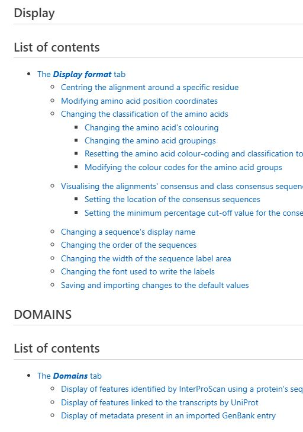

# CreateGitHubContentsSection

___CreateGitHubContentsSection___ reads all the *.md GitHub markdown files in a folder and its subfolders and collects all their section headings. These are then used to make a section contents file containing links to each of the sections in the scanned *.md files. The contents file can be used as is, or sections can be copied and pasted into the individual user guide files.

## Selecting a folder 

A folder is selected by pressing the __Select__ button (blue line in Figure 1). 

*Figure 1: Pressing the __Select__ button will prompt you to select the folder.*

---

## Selecting the right folder

The selected folder will be the base folder for the contents file, so all the links will assume that they are in a file in this folder. For instance, if you have a folder containing the introductory Readme.md file and a second folder containing the guide as a set of *.md files, ___CreateGitHubContentsSection___ will create a contents file that should be placed in this folder and not the user guide folder. Links in this file will connect to the file sections in the guide from the guide's parent folder, but not the folder containing the guide. If you want to create a contents file that contains links that will work for files in the guide's folder, select the folder containing the guide.

## Selecting and ordering the individual files to be included

When a folder has been selected, the names of the files will appear in the drop-down list (blue box in Figure 2). To add a file to be included, select its name in the list and press the __Add__ button (red line in Figure 2). 

*Figure 2: The folder will contain a list of *.md files.*

---

Add the files in the order you wish them to be included in the file contents file (Figure 3). To delete a file, select its name from the drop-down list and press __Add__ again.

*Figure 3: Select the files in the desired order.*

---

## Excluding a file from the contents file

While it's possible to remove a file from the list by selecting it in the dropdown list and pressing the __Add__ button, they can also be excluded from the final contents file by checking the tick box to the left of its name (Figure 4).

*Figure 4: Since the tickbox to the left of __Genbank.md__ has been ticked, it will be excluded from the final contents file.*

---

## Making the contents file

Once the files have been added in the required order, press the __Make__ button (blue line in figure 5). This will create a file called _ContentsSection.md_ in the selected folder (Figures 6a and 6b). 

*Figure 4: The ContentsSection.md file viewed as a text file.*

---

*Figure 5b: The ContentsSection.md file viewed as a GitHub readme file.*

---

